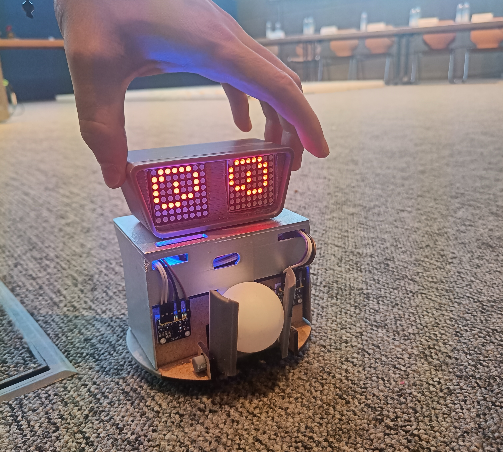

# Ball-E
This is the code base that controlls our robot Ball-E. It is a micromouse robot that is also capable of picking up a ball before solving the maze. We've developed it as part of the [Advisor program](https://www.ce.cit.tum.de/lsr/lehre/advisor/) 2023 at TUM (Technical University of Munich).

## Story
We are writing the year 3012. Humans have long since left Earth with their mega spaceships. However, the fuel, butadiene, is slowly running out, endangering the future of humanity. Fortunately, there is a nearby planet where there are balls full of the aforementioned fuel. Unfortunately, the environment on this planet is highly polluted and too toxic for human visitors. The clever scientists at Ad.Visor™ have developed a highly intelligent robot that fights its way through the wild jungle, collects the balls, and finds the shortest way back. It is the hour of BallE.

## Hardware
- DC Motors: Two powerful 6V motors mounted on an axle drive Ball-E forward.
- Tires: Two tires on the left and right, each with a diameter of 40 mm.
- Magnetic Encoders: Two magnetic encoders attached to the motors to measure their rotations.
- Servo Motor: A servo motor pulls the arms at the front to lift the ball.
- Arms: The 3D-printed arms at the front serve as the ball pick-up mechanism.
- Support Wheels: Two freely rolling balls at the front and back provide stability.
- Circuit Board: The circuit board is used for the simple assembly of electrical components and includes:
    - Processor Unit: An ESP32 MCU responsible for processing sensor data, controlling the robot, and calculating algorithms.
    - Motor Driver: A motor driver supplies power to the motors and allows for more precise control of the motors.
- Sensors: Ball-E uses sensors to navigate its environment:
    - Two TOF (Time-of-Flight) sensors at the front for precise wall following.
    - Two TOF sensors at the back left and right for wall detection and distance measurement.
    - One gyroscope for angle determination.
- Base Plate: The base plate is cut from medium-density fiberboard (MDF) with a thickness of 3 mm.
- Head: The head of Ball-E contains:
    - Processor Unit: An ESP32 MCU controls the appearance of the LED matrices.
    - LED Matrices: Two LED matrices serve as Ball-E's eyes.

## Software
- Flood Fill & Reverse Flood Fill Algorithm: Used to explore the maze and find the path to the goal as well as the way back to the start.
- BFS: After exploration, Ball-E calculates the shortest path by overlapping both maze traversals and calculating the shortest path using Breadth-first-search
- PD-Controller: We use PD to ensure that our robot drives straight.
  - Proportional term: Difference of the magnetic encoders
  - Derivative term: angular velocity